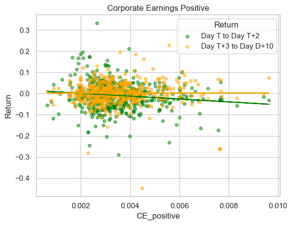
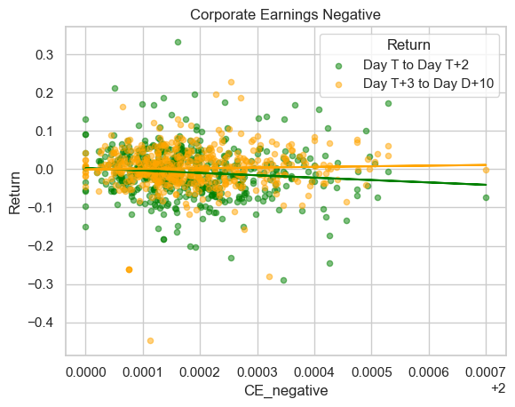
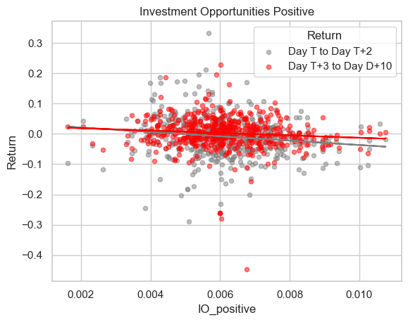
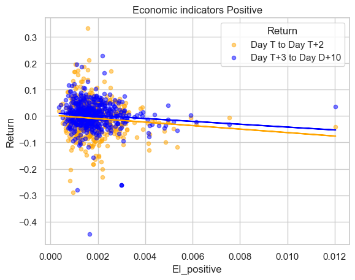
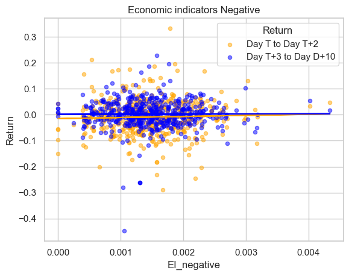
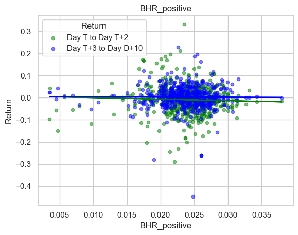
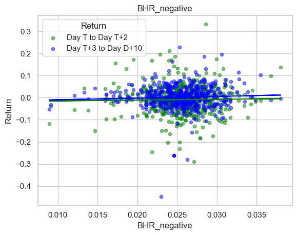
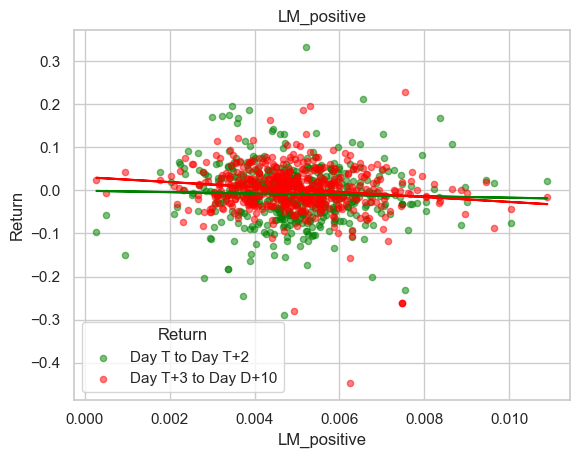
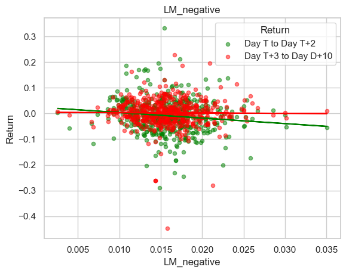

```python
import fnmatch
import glob
import os
import re
from time import sleep
from zipfile import ZipFile
from sec_edgar_downloader import Downloader

import numpy as np
import pandas as pd
from bs4 import BeautifulSoup
from near_regex import NEAR_regex  
from tqdm import tqdm  


```


```python
# get a file with sample firms and info on them
# (somewhat simplistic option!)

sp500_file = 'inputs/sp500_2022.csv'

if not os.path.exists(sp500_file):
    url = 'https://en.wikipedia.org/wiki/List_of_S%26P_500_companies'
    pd.read_html(url)[0].to_csv(sp500_file,index=False)

sp500 = pd.read_csv('inputs/sp500_2022.csv')    
sp500
```


<div>
<style scoped>
    .dataframe tbody tr th:only-of-type {
        vertical-align: middle;
    }

    .dataframe tbody tr th {
        vertical-align: top;
    }

    .dataframe thead th {
        text-align: right;
    }
</style>
<table border="1" class="dataframe">
  <thead>
    <tr style="text-align: right;">
      <th></th>
      <th>Symbol</th>
      <th>Security</th>
      <th>GICS Sector</th>
      <th>GICS Sub-Industry</th>
      <th>Headquarters Location</th>
      <th>Date added</th>
      <th>CIK</th>
      <th>Founded</th>
    </tr>
  </thead>
  <tbody>
    <tr>
      <th>0</th>
      <td>MMM</td>
      <td>3M</td>
      <td>Industrials</td>
      <td>Industrial Conglomerates</td>
      <td>Saint Paul, Minnesota</td>
      <td>1957-03-04</td>
      <td>66740</td>
      <td>1902</td>
    </tr>
    <tr>
      <th>1</th>
      <td>AOS</td>
      <td>A. O. Smith</td>
      <td>Industrials</td>
      <td>Building Products</td>
      <td>Milwaukee, Wisconsin</td>
      <td>2017-07-26</td>
      <td>91142</td>
      <td>1916</td>
    </tr>
    <tr>
      <th>2</th>
      <td>ABT</td>
      <td>Abbott</td>
      <td>Health Care</td>
      <td>Health Care Equipment</td>
      <td>North Chicago, Illinois</td>
      <td>1957-03-04</td>
      <td>1800</td>
      <td>1888</td>
    </tr>
    <tr>
      <th>3</th>
      <td>ABBV</td>
      <td>AbbVie</td>
      <td>Health Care</td>
      <td>Pharmaceuticals</td>
      <td>North Chicago, Illinois</td>
      <td>2012-12-31</td>
      <td>1551152</td>
      <td>2013 (1888)</td>
    </tr>
    <tr>
      <th>4</th>
      <td>ACN</td>
      <td>Accenture</td>
      <td>Information Technology</td>
      <td>IT Consulting &amp; Other Services</td>
      <td>Dublin, Ireland</td>
      <td>2011-07-06</td>
      <td>1467373</td>
      <td>1989</td>
    </tr>
    <tr>
      <th>...</th>
      <td>...</td>
      <td>...</td>
      <td>...</td>
      <td>...</td>
      <td>...</td>
      <td>...</td>
      <td>...</td>
      <td>...</td>
    </tr>
    <tr>
      <th>498</th>
      <td>YUM</td>
      <td>Yum! Brands</td>
      <td>Consumer Discretionary</td>
      <td>Restaurants</td>
      <td>Louisville, Kentucky</td>
      <td>1997-10-06</td>
      <td>1041061</td>
      <td>1997</td>
    </tr>
    <tr>
      <th>499</th>
      <td>ZBRA</td>
      <td>Zebra Technologies</td>
      <td>Information Technology</td>
      <td>Electronic Equipment &amp; Instruments</td>
      <td>Lincolnshire, Illinois</td>
      <td>2019-12-23</td>
      <td>877212</td>
      <td>1969</td>
    </tr>
    <tr>
      <th>500</th>
      <td>ZBH</td>
      <td>Zimmer Biomet</td>
      <td>Health Care</td>
      <td>Health Care Equipment</td>
      <td>Warsaw, Indiana</td>
      <td>2001-08-07</td>
      <td>1136869</td>
      <td>1927</td>
    </tr>
    <tr>
      <th>501</th>
      <td>ZION</td>
      <td>Zions Bancorporation</td>
      <td>Financials</td>
      <td>Regional Banks</td>
      <td>Salt Lake City, Utah</td>
      <td>2001-06-22</td>
      <td>109380</td>
      <td>1873</td>
    </tr>
    <tr>
      <th>502</th>
      <td>ZTS</td>
      <td>Zoetis</td>
      <td>Health Care</td>
      <td>Pharmaceuticals</td>
      <td>Parsippany, New Jersey</td>
      <td>2013-06-21</td>
      <td>1555280</td>
      <td>1952</td>
    </tr>
  </tbody>
</table>
<p>503 rows × 8 columns</p>
</div>


```python
dl = Downloader("10k_files") # all files will go within this folder
```


```python
stocks=sp500['Symbol'].to_list()
```


```python

from io import BytesIO
from zipfile import ZipFile
from urllib.request import urlopen
```


```python
url = 'https://github.com/LeDataSciFi/data/blob/main/Stock%20Returns%20(CRSP)/crsp_2022_only.zip?raw=true'
#ccm = pd.read_stata(url)   
# <-- that code would work if I had uploaded the data as a csv file, but GH said it was too big to upload 
# so I zipped it. We need a little workaround to download it:

with urlopen(url) as request:
    data = BytesIO(request.read())

with ZipFile(data) as archive:
    with archive.open(archive.namelist()[0]) as stata:
        ccm = pd.read_stata(stata)
```


```python
ccm['date'] = pd.to_datetime(ccm['date'])
ccm
```


<div>
<style scoped>
    .dataframe tbody tr th:only-of-type {
        vertical-align: middle;
    }

    .dataframe tbody tr th {
        vertical-align: top;
    }

    .dataframe thead th {
        text-align: right;
    }
</style>
<table border="1" class="dataframe">
  <thead>
    <tr style="text-align: right;">
      <th></th>
      <th>ticker</th>
      <th>date</th>
      <th>ret</th>
    </tr>
  </thead>
  <tbody>
    <tr>
      <th>0</th>
      <td>JJSF</td>
      <td>2021-12-01</td>
      <td>-0.011276</td>
    </tr>
    <tr>
      <th>1</th>
      <td>JJSF</td>
      <td>2021-12-02</td>
      <td>0.030954</td>
    </tr>
    <tr>
      <th>2</th>
      <td>JJSF</td>
      <td>2021-12-03</td>
      <td>0.000287</td>
    </tr>
    <tr>
      <th>3</th>
      <td>JJSF</td>
      <td>2021-12-06</td>
      <td>0.014362</td>
    </tr>
    <tr>
      <th>4</th>
      <td>JJSF</td>
      <td>2021-12-07</td>
      <td>0.012459</td>
    </tr>
    <tr>
      <th>...</th>
      <td>...</td>
      <td>...</td>
      <td>...</td>
    </tr>
    <tr>
      <th>2587061</th>
      <td>TSLA</td>
      <td>2022-12-23</td>
      <td>-0.017551</td>
    </tr>
    <tr>
      <th>2587062</th>
      <td>TSLA</td>
      <td>2022-12-27</td>
      <td>-0.114089</td>
    </tr>
    <tr>
      <th>2587063</th>
      <td>TSLA</td>
      <td>2022-12-28</td>
      <td>0.033089</td>
    </tr>
    <tr>
      <th>2587064</th>
      <td>TSLA</td>
      <td>2022-12-29</td>
      <td>0.080827</td>
    </tr>
    <tr>
      <th>2587065</th>
      <td>TSLA</td>
      <td>2022-12-30</td>
      <td>0.011164</td>
    </tr>
  </tbody>
</table>
<p>2587066 rows × 3 columns</p>
</div>


```python
import pandas as pd
from zipfile import ZipFile

# open the zip file
with ZipFile('10K_files/10k_files.zip', 'r') as zipfolder:
    # get the list of file names
    file_names = zipfolder.namelist()

# create an empty list to store the data
data = []

# iterate over the file names
for file_name in file_names:
    # extract the filing ID and company name from the file name
    filing_id = file_name.split('/')[3]
    company_name = file_name.split('/')[1]
    
    # create a dictionary for the current item
    row = {'filing_id': filing_id, 'company_name': company_name}
    
    # add the dictionary to the list
    data.append(row)

# create a DataFrame from the list of dictionaries
df = pd.DataFrame(data)

# print the resulting DataFrame
print(df)
```

                    filing_id company_name
    0    0000066740-22-000010          MMM
    1    0000091142-22-000028          AOS
    2    0001104659-22-025141          ABT
    3    0001551152-22-000007         ABBV
    4    0001467373-22-000295          ACN
    ..                    ...          ...
    494  0001564590-22-007640          YUM
    495  0000877212-22-000026         ZBRA
    496  0001564590-22-007160          ZBH
    497  0001213900-22-013250         ZION
    498  0001555280-22-000078          ZTS
    
    [499 rows x 2 columns]


# Merge df with s&p500
-----


```python
cleandata=sp500.merge(df,left_on='Symbol',right_on='company_name',how='inner',validate='1:m')
cleandata
```


<div>
<style scoped>
    .dataframe tbody tr th:only-of-type {
        vertical-align: middle;
    }

    .dataframe tbody tr th {
        vertical-align: top;
    }

    .dataframe thead th {
        text-align: right;
    }
</style>
<table border="1" class="dataframe">
  <thead>
    <tr style="text-align: right;">
      <th></th>
      <th>Symbol</th>
      <th>Security</th>
      <th>GICS Sector</th>
      <th>GICS Sub-Industry</th>
      <th>Headquarters Location</th>
      <th>Date added</th>
      <th>CIK</th>
      <th>Founded</th>
      <th>filing_id</th>
      <th>company_name</th>
    </tr>
  </thead>
  <tbody>
    <tr>
      <th>0</th>
      <td>MMM</td>
      <td>3M</td>
      <td>Industrials</td>
      <td>Industrial Conglomerates</td>
      <td>Saint Paul, Minnesota</td>
      <td>1957-03-04</td>
      <td>66740</td>
      <td>1902</td>
      <td>0000066740-22-000010</td>
      <td>MMM</td>
    </tr>
    <tr>
      <th>1</th>
      <td>AOS</td>
      <td>A. O. Smith</td>
      <td>Industrials</td>
      <td>Building Products</td>
      <td>Milwaukee, Wisconsin</td>
      <td>2017-07-26</td>
      <td>91142</td>
      <td>1916</td>
      <td>0000091142-22-000028</td>
      <td>AOS</td>
    </tr>
    <tr>
      <th>2</th>
      <td>ABT</td>
      <td>Abbott</td>
      <td>Health Care</td>
      <td>Health Care Equipment</td>
      <td>North Chicago, Illinois</td>
      <td>1957-03-04</td>
      <td>1800</td>
      <td>1888</td>
      <td>0001104659-22-025141</td>
      <td>ABT</td>
    </tr>
    <tr>
      <th>3</th>
      <td>ABBV</td>
      <td>AbbVie</td>
      <td>Health Care</td>
      <td>Pharmaceuticals</td>
      <td>North Chicago, Illinois</td>
      <td>2012-12-31</td>
      <td>1551152</td>
      <td>2013 (1888)</td>
      <td>0001551152-22-000007</td>
      <td>ABBV</td>
    </tr>
    <tr>
      <th>4</th>
      <td>ACN</td>
      <td>Accenture</td>
      <td>Information Technology</td>
      <td>IT Consulting &amp; Other Services</td>
      <td>Dublin, Ireland</td>
      <td>2011-07-06</td>
      <td>1467373</td>
      <td>1989</td>
      <td>0001467373-22-000295</td>
      <td>ACN</td>
    </tr>
    <tr>
      <th>...</th>
      <td>...</td>
      <td>...</td>
      <td>...</td>
      <td>...</td>
      <td>...</td>
      <td>...</td>
      <td>...</td>
      <td>...</td>
      <td>...</td>
      <td>...</td>
    </tr>
    <tr>
      <th>494</th>
      <td>YUM</td>
      <td>Yum! Brands</td>
      <td>Consumer Discretionary</td>
      <td>Restaurants</td>
      <td>Louisville, Kentucky</td>
      <td>1997-10-06</td>
      <td>1041061</td>
      <td>1997</td>
      <td>0001564590-22-007640</td>
      <td>YUM</td>
    </tr>
    <tr>
      <th>495</th>
      <td>ZBRA</td>
      <td>Zebra Technologies</td>
      <td>Information Technology</td>
      <td>Electronic Equipment &amp; Instruments</td>
      <td>Lincolnshire, Illinois</td>
      <td>2019-12-23</td>
      <td>877212</td>
      <td>1969</td>
      <td>0000877212-22-000026</td>
      <td>ZBRA</td>
    </tr>
    <tr>
      <th>496</th>
      <td>ZBH</td>
      <td>Zimmer Biomet</td>
      <td>Health Care</td>
      <td>Health Care Equipment</td>
      <td>Warsaw, Indiana</td>
      <td>2001-08-07</td>
      <td>1136869</td>
      <td>1927</td>
      <td>0001564590-22-007160</td>
      <td>ZBH</td>
    </tr>
    <tr>
      <th>497</th>
      <td>ZION</td>
      <td>Zions Bancorporation</td>
      <td>Financials</td>
      <td>Regional Banks</td>
      <td>Salt Lake City, Utah</td>
      <td>2001-06-22</td>
      <td>109380</td>
      <td>1873</td>
      <td>0001213900-22-013250</td>
      <td>ZION</td>
    </tr>
    <tr>
      <th>498</th>
      <td>ZTS</td>
      <td>Zoetis</td>
      <td>Health Care</td>
      <td>Pharmaceuticals</td>
      <td>Parsippany, New Jersey</td>
      <td>2013-06-21</td>
      <td>1555280</td>
      <td>1952</td>
      <td>0001555280-22-000078</td>
      <td>ZTS</td>
    </tr>
  </tbody>
</table>
<p>499 rows × 10 columns</p>
</div>


```python
with ZipFile('10K_files/10k_files.zip','r') as zipfolder:
    acsnum_list=zipfolder.namelist()

    from requests_html import HTMLSession

    session=HTMLSession()
    datanew=[]
    for i, row in cleandata.iterrows():
        firm=row['Symbol']
        firm_name=row['Security']
        cik=row['CIK']
        accession_number=row['filing_id']
    
        url = f'https://www.sec.gov/Archives/edgar/data/{cik}/{accession_number}-index.html'
        r = session.get(url)
        soup=BeautifulSoup(r.text, 'html.parser')
        filing_date=soup.find('div',text='Filing Date').find_next_sibling('div').text.strip()
        datanew.append({'Symbol':firm, 'Security':firm_name, 'CIK':cik, 'Accession_Num':accession_number,'Filing Date':filing_date})
filing_date=pd.DataFrame(datanew)
```


```python
#Merge filing data with filing date with data with return
data1=ccm.merge(filing_date,left_on='ticker',right_on='Symbol',how='inner')
data1
```


<div>
<style scoped>
    .dataframe tbody tr th:only-of-type {
        vertical-align: middle;
    }

    .dataframe tbody tr th {
        vertical-align: top;
    }

    .dataframe thead th {
        text-align: right;
    }
</style>
<table border="1" class="dataframe">
  <thead>
    <tr style="text-align: right;">
      <th></th>
      <th>ticker</th>
      <th>date</th>
      <th>ret</th>
      <th>Symbol</th>
      <th>Security</th>
      <th>CIK</th>
      <th>Accession_Num</th>
      <th>Filing Date</th>
    </tr>
  </thead>
  <tbody>
    <tr>
      <th>0</th>
      <td>ORCL</td>
      <td>2021-12-01</td>
      <td>-0.010910</td>
      <td>ORCL</td>
      <td>Oracle Corporation</td>
      <td>1341439</td>
      <td>0001564590-22-023675</td>
      <td>2022-06-21</td>
    </tr>
    <tr>
      <th>1</th>
      <td>ORCL</td>
      <td>2021-12-02</td>
      <td>0.002674</td>
      <td>ORCL</td>
      <td>Oracle Corporation</td>
      <td>1341439</td>
      <td>0001564590-22-023675</td>
      <td>2022-06-21</td>
    </tr>
    <tr>
      <th>2</th>
      <td>ORCL</td>
      <td>2021-12-03</td>
      <td>-0.019447</td>
      <td>ORCL</td>
      <td>Oracle Corporation</td>
      <td>1341439</td>
      <td>0001564590-22-023675</td>
      <td>2022-06-21</td>
    </tr>
    <tr>
      <th>3</th>
      <td>ORCL</td>
      <td>2021-12-06</td>
      <td>0.007933</td>
      <td>ORCL</td>
      <td>Oracle Corporation</td>
      <td>1341439</td>
      <td>0001564590-22-023675</td>
      <td>2022-06-21</td>
    </tr>
    <tr>
      <th>4</th>
      <td>ORCL</td>
      <td>2021-12-07</td>
      <td>0.012480</td>
      <td>ORCL</td>
      <td>Oracle Corporation</td>
      <td>1341439</td>
      <td>0001564590-22-023675</td>
      <td>2022-06-21</td>
    </tr>
    <tr>
      <th>...</th>
      <td>...</td>
      <td>...</td>
      <td>...</td>
      <td>...</td>
      <td>...</td>
      <td>...</td>
      <td>...</td>
      <td>...</td>
    </tr>
    <tr>
      <th>135625</th>
      <td>TSLA</td>
      <td>2022-12-23</td>
      <td>-0.017551</td>
      <td>TSLA</td>
      <td>Tesla, Inc.</td>
      <td>1318605</td>
      <td>0000950170-22-000796</td>
      <td>2022-02-07</td>
    </tr>
    <tr>
      <th>135626</th>
      <td>TSLA</td>
      <td>2022-12-27</td>
      <td>-0.114089</td>
      <td>TSLA</td>
      <td>Tesla, Inc.</td>
      <td>1318605</td>
      <td>0000950170-22-000796</td>
      <td>2022-02-07</td>
    </tr>
    <tr>
      <th>135627</th>
      <td>TSLA</td>
      <td>2022-12-28</td>
      <td>0.033089</td>
      <td>TSLA</td>
      <td>Tesla, Inc.</td>
      <td>1318605</td>
      <td>0000950170-22-000796</td>
      <td>2022-02-07</td>
    </tr>
    <tr>
      <th>135628</th>
      <td>TSLA</td>
      <td>2022-12-29</td>
      <td>0.080827</td>
      <td>TSLA</td>
      <td>Tesla, Inc.</td>
      <td>1318605</td>
      <td>0000950170-22-000796</td>
      <td>2022-02-07</td>
    </tr>
    <tr>
      <th>135629</th>
      <td>TSLA</td>
      <td>2022-12-30</td>
      <td>0.011164</td>
      <td>TSLA</td>
      <td>Tesla, Inc.</td>
      <td>1318605</td>
      <td>0000950170-22-000796</td>
      <td>2022-02-07</td>
    </tr>
  </tbody>
</table>
<p>135630 rows × 8 columns</p>
</div>


```python

# Convert date and filing_date columns to datetime objects
data1['date'] = pd.to_datetime(data1['date'])
data1['Filing Date'] = pd.to_datetime(data1['Filing Date'])

# Calculate days since filing for each row
data1['Count'] = data1.apply(lambda row: (row['date'] - row['Filing Date']).days if row['date'] >= row['Filing Date'] else -2, axis=1)

# Filter to only include rows where days_since_filing is between 0 and 2
filt = data1[(data1['Count'] >= 0) & (data1['Count'] <= 2)]

# Group by ticker and calculate cumulative return for days_since_filing between 0 and 2
cumulative_return1 = filt.groupby('Symbol')['ret'].apply(lambda x: np.prod(1+x)-1)

print(cumulative_return1)

# Filter to only include rows where days_since_filing is between 3 and 10
filt1 = data1[(data1['Count'] >= 3) & (data1['Count'] <= 10)]

# Group by ticker and calculate cumulative return for days_since_filing between 3 and 10
cumulative_return2 = filt1.groupby('Symbol')['ret'].apply(lambda x: np.prod(1+x)-1)

print(cumulative_return2)

# Merge the two cumulative return dataframes and rename columns
CR_t7 = pd.DataFrame(cumulative_return1).rename(columns={'ret':'ret_t7'})
CR_t2 = pd.DataFrame(cumulative_return2).rename(columns={'ret':'ret_t2'})
cumulative_returns = CR_t2.merge(CR_t7, how='right', on='Symbol', indicator=True, validate='1:1')

print(cumulative_returns)
```

    Symbol
    A       0.008788
    AAL    -0.050923
    AAP    -0.017255
    AAPL    0.075553
    ABBV   -0.006484
              ...   
    YUM    -0.013902
    ZBH     0.026077
    ZBRA   -0.127031
    ZION   -0.014667
    ZTS    -0.017105
    Name: ret, Length: 491, dtype: float64
    Symbol
    A       0.004322
    AAL    -0.139741
    AAP    -0.067329
    AAPL   -0.106518
    ABBV    0.025967
              ...   
    YUM    -0.050656
    ZBH    -0.060145
    ZBRA   -0.048513
    ZION    0.047605
    ZTS     0.008494
    Name: ret, Length: 491, dtype: float64
              ret_t2    ret_t7 _merge
    Symbol                           
    A       0.004322  0.008788   both
    AAL    -0.139741 -0.050923   both
    AAP    -0.067329 -0.017255   both
    AAPL   -0.106518  0.075553   both
    ABBV    0.025967 -0.006484   both
    ...          ...       ...    ...
    YUM    -0.050656 -0.013902   both
    ZBH    -0.060145  0.026077   both
    ZBRA   -0.048513 -0.127031   both
    ZION    0.047605 -0.014667   both
    ZTS     0.008494 -0.017105   both
    
    [491 rows x 3 columns]


# Sentimental analysis


```python
# places to put files - best practice chapter 2!

os.makedirs("inputs", exist_ok=True)
os.makedirs("10k_files", exist_ok=True)
```


```python
LM = pd.read_csv('inputs/LM_MasterDictionary_1993-2021.csv')
LM_negative = LM.query('Negative > 0')['Word'].to_list()
LM_positive = LM.query('Positive > 0')['Word'].to_list()

```


```python
df=df.copy()

# open the zip file (do this before the for loop
# so you only open it one time... faster)

with ZipFile('/Users/jerrickren/Desktop/FIN377/Class-Notes/Midtermsandbox/10k_files/10k_files.zip','r') as zipfolder:
    
    
    # before the loop, get list of files in zipped folder
    file_list = zipfolder.namelist()
        
    # replace this with how you'd loop over the dataframe
    for index,row in df.iterrows():
        firm=row['company_name']#,"MMM","TSLA"]:
        
        # get a list of possible files for this firm
        
        firm_folder    = "sec-edgar-filings/" + firm + '/10-K/*/*.html'
        possible_files = fnmatch.filter(file_list, firm_folder) 
        
        if len(possible_files) == 0: 
            continue
            
        fpath = possible_files[0] # the first match is the path to the file
        
        
        
        # open the file (this is a little different!)
        with zipfolder.open(fpath) as report_file:
            html = report_file.read().decode(encoding="utf-8")
            soup=BeautifulSoup(html,'lxml-xml')
            for div in soup.find_all("div", {'style':'display:none'}): 
                div.decompose()
            soup=soup.get_text()
            lower=soup.lower()
            no_punc=re.sub(r'\W',' ',lower)  #get rid of those weird symbol
            cleaned=re.sub(r'\s+',' ',no_punc)#fill the blank range
            cleaned
            df.loc[index,'cleaned_html']=cleaned
            
      
```


```python
#ML
BHR_negative = pd.read_csv('/Users/jerrickren/Desktop/FIN377/Class-Notes/Midtermsandbox/inputs/ML_negative_unigram.txt',
            names=['word'])['word'].to_list()
# "r" means we are opening the file in "read" mode ... "w"rite mode means you'll write the file 
with open('inputs/ML_positive_unigram.txt', 'r') as file:
    BHR_positive = [line.strip() for line in file]

```


```python
#LM
LM = pd.read_csv('/Users/jerrickren/Desktop/FIN377/Class-Notes/Midtermsandbox/inputs/LM_MasterDictionary_1993-2021.csv')
LM_negative = LM.query('Negative > 0')['Word'].to_list()
LM_negative_set = set(list(map(lambda x: x.lower(), LM_negative)))
LM_positive = LM.query('Positive > 0')['Word'].to_list()
LM_positive_set = set(list(map(lambda x: x.lower(), LM_positive)))
```


```python
df2=df.copy()
def sentiment_analysis(text, positive_words):
    words = [word.lower().strip('.,!?') for word in text.split()]
    positive_word_count = sum([1 for word in words if word in positive_words])
    return positive_word_count / len(words)


df2['BHR_positive'] = df2['cleaned_html'].apply(lambda text: sentiment_analysis(text, BHR_positive))
```


```python
def sentiment_analysis(text, negative_words):
    words = [word.lower().strip('.,!?') for word in text.split()]
    negative_word_count = sum([1 for word in words if word in negative_words])
    return negative_word_count / len(words)


df2['BHR_negative'] = df2['cleaned_html'].apply(lambda text: sentiment_analysis(text, BHR_negative))
```


```python
def sentiment_analysis(text, LM_negative_words):
    words = [word.lower().strip('.,!?') for word in text.split()]
    LM_negative_word_count = sum([1 for word in words if word in LM_negative_words])
    return LM_negative_word_count / len(words)


df2['LM_negative'] = df2['cleaned_html'].apply(lambda text: sentiment_analysis(text, LM_negative_set))
```


```python
def sentiment_analysis(text, LM_positive_words):
    words = [word.lower().strip('.,!?') for word in text.split()]
    LM_positive_word_count = sum([1 for word in words if word in LM_positive_words])
    return LM_positive_word_count / len(words)


df2['LM_positive'] = df2['cleaned_html'].apply(lambda text: sentiment_analysis(text, LM_positive_set))
```


```python
# Create a copy of the DataFrame to avoid the SettingWithCopyWarning
df2 = df2.copy()

comparison2 = []

for index in df.index:
    comparison2.append(df2.loc[index, 'LM_positive'] > df2.loc[index, 'LM_negative'])

df2['LM_comparison'] = comparison2
df2['LM_comparison'] = df2['LM_comparison'].replace({True: "Positive", False: "Negative"})
```


```python
# Create a copy of the DataFrame to avoid the SettingWithCopyWarning

comparison1 = []

for index in df.index:
    comparison1.append(df2.loc[index, 'BHR_positive'] > df2.loc[index, 'BHR_negative'])

df2['BHR_comparison'] = comparison1
df2['BHR_comparison'] = df2['BHR_comparison'].replace({True: "Positive", False: "Negative"})
```


```python
df2
```


<div>
<style scoped>
    .dataframe tbody tr th:only-of-type {
        vertical-align: middle;
    }

    .dataframe tbody tr th {
        vertical-align: top;
    }

    .dataframe thead th {
        text-align: right;
    }
</style>
<table border="1" class="dataframe">
  <thead>
    <tr style="text-align: right;">
      <th></th>
      <th>filing_id</th>
      <th>company_name</th>
      <th>cleaned_html</th>
      <th>BHR_positive</th>
      <th>BHR_negative</th>
      <th>LM_negative</th>
      <th>LM_positive</th>
      <th>LM_comparison</th>
      <th>BHR_comparison</th>
    </tr>
  </thead>
  <tbody>
    <tr>
      <th>0</th>
      <td>0000066740-22-000010</td>
      <td>MMM</td>
      <td>mmm 20211231table of contentsunited statessec...</td>
      <td>0.025683</td>
      <td>0.031662</td>
      <td>0.023249</td>
      <td>0.003977</td>
      <td>Negative</td>
      <td>Negative</td>
    </tr>
    <tr>
      <th>1</th>
      <td>0000091142-22-000028</td>
      <td>AOS</td>
      <td>aos 20211231united states securities and exch...</td>
      <td>0.024460</td>
      <td>0.023602</td>
      <td>0.012984</td>
      <td>0.003756</td>
      <td>Negative</td>
      <td>Positive</td>
    </tr>
    <tr>
      <th>2</th>
      <td>0001104659-22-025141</td>
      <td>ABT</td>
      <td>0000001800 12 312021fyfalsehttp fasb org us ga...</td>
      <td>0.021590</td>
      <td>0.024394</td>
      <td>0.012793</td>
      <td>0.003726</td>
      <td>Negative</td>
      <td>Negative</td>
    </tr>
    <tr>
      <th>3</th>
      <td>0001551152-22-000007</td>
      <td>ABBV</td>
      <td>abbv 20211231united statessecurities and exch...</td>
      <td>0.019753</td>
      <td>0.022645</td>
      <td>0.015448</td>
      <td>0.006481</td>
      <td>Negative</td>
      <td>Negative</td>
    </tr>
    <tr>
      <th>4</th>
      <td>0001467373-22-000295</td>
      <td>ACN</td>
      <td>acn 20220831table of contentsunited states se...</td>
      <td>0.027968</td>
      <td>0.023964</td>
      <td>0.016861</td>
      <td>0.008642</td>
      <td>Negative</td>
      <td>Positive</td>
    </tr>
    <tr>
      <th>...</th>
      <td>...</td>
      <td>...</td>
      <td>...</td>
      <td>...</td>
      <td>...</td>
      <td>...</td>
      <td>...</td>
      <td>...</td>
      <td>...</td>
    </tr>
    <tr>
      <th>494</th>
      <td>0001564590-22-007640</td>
      <td>YUM</td>
      <td>yumc 10k_20211231 htm united states securitie...</td>
      <td>0.025014</td>
      <td>0.023482</td>
      <td>0.016549</td>
      <td>0.006078</td>
      <td>Negative</td>
      <td>Positive</td>
    </tr>
    <tr>
      <th>495</th>
      <td>0000877212-22-000026</td>
      <td>ZBRA</td>
      <td>zbra 20211231table of contentsunited statesse...</td>
      <td>0.028396</td>
      <td>0.026842</td>
      <td>0.014964</td>
      <td>0.006258</td>
      <td>Negative</td>
      <td>Positive</td>
    </tr>
    <tr>
      <th>496</th>
      <td>0001564590-22-007160</td>
      <td>ZBH</td>
      <td>zbh 10k_20211231 htm i have united states sec...</td>
      <td>0.021506</td>
      <td>0.026759</td>
      <td>0.021783</td>
      <td>0.004591</td>
      <td>Negative</td>
      <td>Negative</td>
    </tr>
    <tr>
      <th>497</th>
      <td>0001213900-22-013250</td>
      <td>ZION</td>
      <td>united states securities and exchange commiss...</td>
      <td>0.016075</td>
      <td>0.016980</td>
      <td>0.013458</td>
      <td>0.003070</td>
      <td>Negative</td>
      <td>Negative</td>
    </tr>
    <tr>
      <th>498</th>
      <td>0001555280-22-000078</td>
      <td>ZTS</td>
      <td>zts 20211231table of contentsunited states se...</td>
      <td>0.021790</td>
      <td>0.033508</td>
      <td>0.019980</td>
      <td>0.005036</td>
      <td>Negative</td>
      <td>Negative</td>
    </tr>
  </tbody>
</table>
<p>499 rows × 9 columns</p>
</div>


# Financial Uncertainty


```python
#corporate_earnings
#1.positive
corporate_earnings_pos = ['(profitable|successful|strong|growth|increase|revenue|improve|expansion|positive|gain|healthy|rise)']
#2.negative
corporate_earnings_neg = ['(missed|loss|decline|downgrade|disappointing|weak||underperform|negative|struggle|fall|slump|warning)']

#investment_opportunities
#1.positive
investment_opportunities_positive=['(profit|growth|opportunity|return|expansion|innovation|success|diversification|potential|value|market|liquidity)']
#2.negative
investment_opportunities_negative =['(loss|risk|decline|failure|uncertainty|instability|downfall|downturn|volatility|crash|bankruptcy|default)']


#Economic indicators 
#1.Positive
economic_indicators_positive =['(growth|employment|surplus|stimulus|GDP|job|confidence|investment|productivity|prosperity|recovery)']
#2.Negative
economic_indicators_negative = ['(recession|inflation|unemployment|deficit|debt|contraction|austerity|decline|slowdown|stagnation|inequality|bankruptcy)']


corporate_earnings_pos=['('+'|'.join(corporate_earnings_pos)+')']
corporate_earnings_neg=['('+'|'.join(corporate_earnings_neg)+')']


investment_opportunities_positive=['('+'|'.join(investment_opportunities_positive)+')']
investment_opportunities_negative=['('+'|'.join(investment_opportunities_negative)+')']


economic_indicators_positive=['('+'|'.join(economic_indicators_positive)+')']
economic_indicators_negative=['('+'|'.join(economic_indicators_negative)+')']
```


```python
list_k=[]
list_l=[]
list_z=[]
list_x=[]
list_c=[]
list_v=[]
for index,row in df2.iterrows():
    sentence = row['cleaned_html']
    
    CEP_anlysis=(len(re.findall(NEAR_regex(corporate_earnings_pos,partial=False),sentence))/len(sentence.split()))
    
    CEN_anlysis=(len(re.findall(NEAR_regex(corporate_earnings_neg,partial=False),sentence))/len(sentence.split()))
    
    IOP_anlysis=(len(re.findall(NEAR_regex(investment_opportunities_positive,partial=False),sentence))/len(sentence.split()))
    
    ION_anlysis=(len(re.findall(NEAR_regex(investment_opportunities_negative,partial=False),sentence))/len(sentence.split()))
    
    EIP_anlysis=(len(re.findall(NEAR_regex(economic_indicators_positive,partial=False),sentence))/len(sentence.split()))
    
    EIN_anlysis=(len(re.findall(NEAR_regex(economic_indicators_negative,partial=False),sentence))/len(sentence.split()))
    
    list_k.append(CEP_anlysis)
    list_l.append(CEN_anlysis)
    list_z.append(IOP_anlysis)
    list_x.append(ION_anlysis)
    list_c.append(EIP_anlysis)
    list_v.append(EIN_anlysis)
    

df2['CE_positive']=list_k
df2['CE_negative']=list_l
df2['IO_positive']=list_z
df2['IO_negative']=list_x
df2["EI_positive"]=list_c
df2["EI_negative"]=list_v

```


```python
df2
```


<div>
<style scoped>
    .dataframe tbody tr th:only-of-type {
        vertical-align: middle;
    }

    .dataframe tbody tr th {
        vertical-align: top;
    }

    .dataframe thead th {
        text-align: right;
    }
</style>
<table border="1" class="dataframe">
  <thead>
    <tr style="text-align: right;">
      <th></th>
      <th>filing_id</th>
      <th>company_name</th>
      <th>cleaned_html</th>
      <th>BHR_positive</th>
      <th>BHR_negative</th>
      <th>LM_negative</th>
      <th>LM_positive</th>
      <th>LM_comparison</th>
      <th>BHR_comparison</th>
      <th>CE_positive</th>
      <th>CE_negative</th>
      <th>IO_positive</th>
      <th>IO_negative</th>
      <th>EI_positive</th>
      <th>EI_negative</th>
    </tr>
  </thead>
  <tbody>
    <tr>
      <th>0</th>
      <td>0000066740-22-000010</td>
      <td>MMM</td>
      <td>mmm 20211231table of contentsunited statessec...</td>
      <td>0.025683</td>
      <td>0.031662</td>
      <td>0.023249</td>
      <td>0.003977</td>
      <td>Negative</td>
      <td>Negative</td>
      <td>0.002656</td>
      <td>2.000144</td>
      <td>0.005914</td>
      <td>0.003284</td>
      <td>0.001806</td>
      <td>0.002185</td>
    </tr>
    <tr>
      <th>1</th>
      <td>0000091142-22-000028</td>
      <td>AOS</td>
      <td>aos 20211231united states securities and exch...</td>
      <td>0.024460</td>
      <td>0.023602</td>
      <td>0.012984</td>
      <td>0.003756</td>
      <td>Negative</td>
      <td>Positive</td>
      <td>0.002337</td>
      <td>2.000118</td>
      <td>0.006093</td>
      <td>0.004052</td>
      <td>0.001242</td>
      <td>0.001183</td>
    </tr>
    <tr>
      <th>2</th>
      <td>0001104659-22-025141</td>
      <td>ABT</td>
      <td>0000001800 12 312021fyfalsehttp fasb org us ga...</td>
      <td>0.021590</td>
      <td>0.024394</td>
      <td>0.012793</td>
      <td>0.003726</td>
      <td>Negative</td>
      <td>Negative</td>
      <td>0.002958</td>
      <td>2.000077</td>
      <td>0.004860</td>
      <td>0.002459</td>
      <td>0.001978</td>
      <td>0.001498</td>
    </tr>
    <tr>
      <th>3</th>
      <td>0001551152-22-000007</td>
      <td>ABBV</td>
      <td>abbv 20211231united statessecurities and exch...</td>
      <td>0.019753</td>
      <td>0.022645</td>
      <td>0.015448</td>
      <td>0.006481</td>
      <td>Negative</td>
      <td>Negative</td>
      <td>0.002485</td>
      <td>2.000179</td>
      <td>0.006108</td>
      <td>0.002193</td>
      <td>0.001608</td>
      <td>0.001332</td>
    </tr>
    <tr>
      <th>4</th>
      <td>0001467373-22-000295</td>
      <td>ACN</td>
      <td>acn 20220831table of contentsunited states se...</td>
      <td>0.027968</td>
      <td>0.023964</td>
      <td>0.016861</td>
      <td>0.008642</td>
      <td>Negative</td>
      <td>Positive</td>
      <td>0.004177</td>
      <td>2.000423</td>
      <td>0.006833</td>
      <td>0.002906</td>
      <td>0.002522</td>
      <td>0.000539</td>
    </tr>
    <tr>
      <th>...</th>
      <td>...</td>
      <td>...</td>
      <td>...</td>
      <td>...</td>
      <td>...</td>
      <td>...</td>
      <td>...</td>
      <td>...</td>
      <td>...</td>
      <td>...</td>
      <td>...</td>
      <td>...</td>
      <td>...</td>
      <td>...</td>
      <td>...</td>
    </tr>
    <tr>
      <th>494</th>
      <td>0001564590-22-007640</td>
      <td>YUM</td>
      <td>yumc 10k_20211231 htm united states securitie...</td>
      <td>0.025014</td>
      <td>0.023482</td>
      <td>0.016549</td>
      <td>0.006078</td>
      <td>Negative</td>
      <td>Positive</td>
      <td>0.004203</td>
      <td>2.000226</td>
      <td>0.007823</td>
      <td>0.002469</td>
      <td>0.002814</td>
      <td>0.000427</td>
    </tr>
    <tr>
      <th>495</th>
      <td>0000877212-22-000026</td>
      <td>ZBRA</td>
      <td>zbra 20211231table of contentsunited statesse...</td>
      <td>0.028396</td>
      <td>0.026842</td>
      <td>0.014964</td>
      <td>0.006258</td>
      <td>Negative</td>
      <td>Positive</td>
      <td>0.003065</td>
      <td>2.000277</td>
      <td>0.006876</td>
      <td>0.002469</td>
      <td>0.001809</td>
      <td>0.001298</td>
    </tr>
    <tr>
      <th>496</th>
      <td>0001564590-22-007160</td>
      <td>ZBH</td>
      <td>zbh 10k_20211231 htm i have united states sec...</td>
      <td>0.021506</td>
      <td>0.026759</td>
      <td>0.021783</td>
      <td>0.004591</td>
      <td>Negative</td>
      <td>Negative</td>
      <td>0.002496</td>
      <td>2.000493</td>
      <td>0.006285</td>
      <td>0.003589</td>
      <td>0.001263</td>
      <td>0.001309</td>
    </tr>
    <tr>
      <th>497</th>
      <td>0001213900-22-013250</td>
      <td>ZION</td>
      <td>united states securities and exchange commiss...</td>
      <td>0.016075</td>
      <td>0.016980</td>
      <td>0.013458</td>
      <td>0.003070</td>
      <td>Negative</td>
      <td>Negative</td>
      <td>0.001519</td>
      <td>2.000129</td>
      <td>0.005445</td>
      <td>0.002019</td>
      <td>0.000711</td>
      <td>0.000485</td>
    </tr>
    <tr>
      <th>498</th>
      <td>0001555280-22-000078</td>
      <td>ZTS</td>
      <td>zts 20211231table of contentsunited states se...</td>
      <td>0.021790</td>
      <td>0.033508</td>
      <td>0.019980</td>
      <td>0.005036</td>
      <td>Negative</td>
      <td>Negative</td>
      <td>0.004233</td>
      <td>2.000191</td>
      <td>0.005610</td>
      <td>0.002244</td>
      <td>0.001785</td>
      <td>0.000854</td>
    </tr>
  </tbody>
</table>
<p>499 rows × 15 columns</p>
</div>


```python
df3=df2.merge(cumulative_returns, left_on="company_name",right_on='Symbol',how="left")
a=cumulative_returns["ret_t2"].mean()
b=cumulative_returns["ret_t7"].mean()
df3["ret_t2"]=df3["ret_t2"].fillna(a)
df3["ret_t7"]=df3["ret_t7"].fillna(a)
df3
```


<div>
<style scoped>
    .dataframe tbody tr th:only-of-type {
        vertical-align: middle;
    }

    .dataframe tbody tr th {
        vertical-align: top;
    }

    .dataframe thead th {
        text-align: right;
    }
</style>
<table border="1" class="dataframe">
  <thead>
    <tr style="text-align: right;">
      <th></th>
      <th>filing_id</th>
      <th>company_name</th>
      <th>cleaned_html</th>
      <th>BHR_positive</th>
      <th>BHR_negative</th>
      <th>LM_negative</th>
      <th>LM_positive</th>
      <th>LM_comparison</th>
      <th>BHR_comparison</th>
      <th>CE_positive</th>
      <th>CE_negative</th>
      <th>IO_positive</th>
      <th>IO_negative</th>
      <th>EI_positive</th>
      <th>EI_negative</th>
      <th>ret_t2</th>
      <th>ret_t7</th>
      <th>_merge</th>
    </tr>
  </thead>
  <tbody>
    <tr>
      <th>0</th>
      <td>0000066740-22-000010</td>
      <td>MMM</td>
      <td>mmm 20211231table of contentsunited statessec...</td>
      <td>0.025683</td>
      <td>0.031662</td>
      <td>0.023249</td>
      <td>0.003977</td>
      <td>Negative</td>
      <td>Negative</td>
      <td>0.002656</td>
      <td>2.000144</td>
      <td>0.005914</td>
      <td>0.003284</td>
      <td>0.001806</td>
      <td>0.002185</td>
      <td>-0.090256</td>
      <td>-0.017671</td>
      <td>both</td>
    </tr>
    <tr>
      <th>1</th>
      <td>0000091142-22-000028</td>
      <td>AOS</td>
      <td>aos 20211231united states securities and exch...</td>
      <td>0.024460</td>
      <td>0.023602</td>
      <td>0.012984</td>
      <td>0.003756</td>
      <td>Negative</td>
      <td>Positive</td>
      <td>0.002337</td>
      <td>2.000118</td>
      <td>0.006093</td>
      <td>0.004052</td>
      <td>0.001242</td>
      <td>0.001183</td>
      <td>-0.053547</td>
      <td>0.003184</td>
      <td>both</td>
    </tr>
    <tr>
      <th>2</th>
      <td>0001104659-22-025141</td>
      <td>ABT</td>
      <td>0000001800 12 312021fyfalsehttp fasb org us ga...</td>
      <td>0.021590</td>
      <td>0.024394</td>
      <td>0.012793</td>
      <td>0.003726</td>
      <td>Negative</td>
      <td>Negative</td>
      <td>0.002958</td>
      <td>2.000077</td>
      <td>0.004860</td>
      <td>0.002459</td>
      <td>0.001978</td>
      <td>0.001498</td>
      <td>0.013731</td>
      <td>-0.027617</td>
      <td>both</td>
    </tr>
    <tr>
      <th>3</th>
      <td>0001551152-22-000007</td>
      <td>ABBV</td>
      <td>abbv 20211231united statessecurities and exch...</td>
      <td>0.019753</td>
      <td>0.022645</td>
      <td>0.015448</td>
      <td>0.006481</td>
      <td>Negative</td>
      <td>Negative</td>
      <td>0.002485</td>
      <td>2.000179</td>
      <td>0.006108</td>
      <td>0.002193</td>
      <td>0.001608</td>
      <td>0.001332</td>
      <td>0.018329</td>
      <td>0.012347</td>
      <td>both</td>
    </tr>
    <tr>
      <th>4</th>
      <td>0001467373-22-000295</td>
      <td>ACN</td>
      <td>acn 20220831table of contentsunited states se...</td>
      <td>0.027968</td>
      <td>0.023964</td>
      <td>0.016861</td>
      <td>0.008642</td>
      <td>Negative</td>
      <td>Positive</td>
      <td>0.004177</td>
      <td>2.000423</td>
      <td>0.006833</td>
      <td>0.002906</td>
      <td>0.002522</td>
      <td>0.000539</td>
      <td>0.107431</td>
      <td>0.003446</td>
      <td>both</td>
    </tr>
    <tr>
      <th>...</th>
      <td>...</td>
      <td>...</td>
      <td>...</td>
      <td>...</td>
      <td>...</td>
      <td>...</td>
      <td>...</td>
      <td>...</td>
      <td>...</td>
      <td>...</td>
      <td>...</td>
      <td>...</td>
      <td>...</td>
      <td>...</td>
      <td>...</td>
      <td>...</td>
      <td>...</td>
      <td>...</td>
    </tr>
    <tr>
      <th>494</th>
      <td>0001564590-22-007640</td>
      <td>YUM</td>
      <td>yumc 10k_20211231 htm united states securitie...</td>
      <td>0.025014</td>
      <td>0.023482</td>
      <td>0.016549</td>
      <td>0.006078</td>
      <td>Negative</td>
      <td>Positive</td>
      <td>0.004203</td>
      <td>2.000226</td>
      <td>0.007823</td>
      <td>0.002469</td>
      <td>0.002814</td>
      <td>0.000427</td>
      <td>-0.070328</td>
      <td>-0.013902</td>
      <td>both</td>
    </tr>
    <tr>
      <th>495</th>
      <td>0000877212-22-000026</td>
      <td>ZBRA</td>
      <td>zbra 20211231table of contentsunited statesse...</td>
      <td>0.028396</td>
      <td>0.026842</td>
      <td>0.014964</td>
      <td>0.006258</td>
      <td>Negative</td>
      <td>Positive</td>
      <td>0.003065</td>
      <td>2.000277</td>
      <td>0.006876</td>
      <td>0.002469</td>
      <td>0.001809</td>
      <td>0.001298</td>
      <td>-0.019582</td>
      <td>-0.157306</td>
      <td>both</td>
    </tr>
    <tr>
      <th>496</th>
      <td>0001564590-22-007160</td>
      <td>ZBH</td>
      <td>zbh 10k_20211231 htm i have united states sec...</td>
      <td>0.021506</td>
      <td>0.026759</td>
      <td>0.021783</td>
      <td>0.004591</td>
      <td>Negative</td>
      <td>Negative</td>
      <td>0.002496</td>
      <td>2.000493</td>
      <td>0.006285</td>
      <td>0.003589</td>
      <td>0.001263</td>
      <td>0.001309</td>
      <td>-0.042855</td>
      <td>0.026020</td>
      <td>both</td>
    </tr>
    <tr>
      <th>497</th>
      <td>0001213900-22-013250</td>
      <td>ZION</td>
      <td>united states securities and exchange commiss...</td>
      <td>0.016075</td>
      <td>0.016980</td>
      <td>0.013458</td>
      <td>0.003070</td>
      <td>Negative</td>
      <td>Negative</td>
      <td>0.001519</td>
      <td>2.000129</td>
      <td>0.005445</td>
      <td>0.002019</td>
      <td>0.000711</td>
      <td>0.000485</td>
      <td>-0.032468</td>
      <td>-0.015974</td>
      <td>both</td>
    </tr>
    <tr>
      <th>498</th>
      <td>0001555280-22-000078</td>
      <td>ZTS</td>
      <td>zts 20211231table of contentsunited states se...</td>
      <td>0.021790</td>
      <td>0.033508</td>
      <td>0.019980</td>
      <td>0.005036</td>
      <td>Negative</td>
      <td>Negative</td>
      <td>0.004233</td>
      <td>2.000191</td>
      <td>0.005610</td>
      <td>0.002244</td>
      <td>0.001785</td>
      <td>0.000854</td>
      <td>0.015538</td>
      <td>-0.017105</td>
      <td>both</td>
    </tr>
  </tbody>
</table>
<p>499 rows × 18 columns</p>
</div>


```python
url2 = 'https://github.com/LeDataSciFi/data/blob/main/Firm%20Year%20Datasets%20(Compustat)/2021_ccm_cleaned.dta?raw=true'

with urlopen(url2) as request:
    data2 = BytesIO(request.read())

ccm2 = pd.read_stata(data2)

```


```python
ccm2=ccm2.rename(columns={"tic": "Symbol"})
ccm2.merge(cumulative_returns, on="Symbol", how="right")
```


<div>
<style scoped>
    .dataframe tbody tr th:only-of-type {
        vertical-align: middle;
    }

    .dataframe tbody tr th {
        vertical-align: top;
    }

    .dataframe thead th {
        text-align: right;
    }
</style>
<table border="1" class="dataframe">
  <thead>
    <tr style="text-align: right;">
      <th></th>
      <th>gvkey</th>
      <th>fyear</th>
      <th>Symbol</th>
      <th>lpermno</th>
      <th>lpermco</th>
      <th>datadate</th>
      <th>sic</th>
      <th>sic3</th>
      <th>td</th>
      <th>long_debt_dum</th>
      <th>...</th>
      <th>cash_a</th>
      <th>xrd_a</th>
      <th>dltt_a</th>
      <th>invopps_FG09</th>
      <th>sales_g</th>
      <th>dv_a</th>
      <th>short_debt</th>
      <th>ret_t2</th>
      <th>ret_t7</th>
      <th>_merge</th>
    </tr>
  </thead>
  <tbody>
    <tr>
      <th>0</th>
      <td>126554.0</td>
      <td>2021.0</td>
      <td>A</td>
      <td>87432.0</td>
      <td>36364.0</td>
      <td>2021-10-31</td>
      <td>3826.0</td>
      <td>382.0</td>
      <td>2911.000000</td>
      <td>1.0</td>
      <td>...</td>
      <td>0.147128</td>
      <td>0.041196</td>
      <td>0.267071</td>
      <td>4.734700</td>
      <td>0.183555</td>
      <td>0.022046</td>
      <td>0.017863</td>
      <td>0.004322</td>
      <td>0.008788</td>
      <td>both</td>
    </tr>
    <tr>
      <th>1</th>
      <td>1045.0</td>
      <td>2021.0</td>
      <td>AAL</td>
      <td>21020.0</td>
      <td>20010.0</td>
      <td>2021-12-31</td>
      <td>4512.0</td>
      <td>451.0</td>
      <td>46177.000000</td>
      <td>1.0</td>
      <td>...</td>
      <td>0.201920</td>
      <td>0.000000</td>
      <td>0.634616</td>
      <td>0.868619</td>
      <td>0.723597</td>
      <td>0.000000</td>
      <td>0.086537</td>
      <td>-0.139741</td>
      <td>-0.050923</td>
      <td>both</td>
    </tr>
    <tr>
      <th>2</th>
      <td>145977.0</td>
      <td>2021.0</td>
      <td>AAP</td>
      <td>89217.0</td>
      <td>42402.0</td>
      <td>2021-12-31</td>
      <td>5531.0</td>
      <td>553.0</td>
      <td>3837.092041</td>
      <td>1.0</td>
      <td>...</td>
      <td>0.049321</td>
      <td>0.000000</td>
      <td>0.276522</td>
      <td>1.540528</td>
      <td>0.088229</td>
      <td>0.013197</td>
      <td>0.121217</td>
      <td>-0.067329</td>
      <td>-0.017255</td>
      <td>both</td>
    </tr>
    <tr>
      <th>3</th>
      <td>1690.0</td>
      <td>2021.0</td>
      <td>AAPL</td>
      <td>14593.0</td>
      <td>7.0</td>
      <td>2021-09-30</td>
      <td>3663.0</td>
      <td>366.0</td>
      <td>136522.000000</td>
      <td>1.0</td>
      <td>...</td>
      <td>0.178458</td>
      <td>0.062433</td>
      <td>0.340115</td>
      <td>NaN</td>
      <td>0.332594</td>
      <td>0.041216</td>
      <td>0.125555</td>
      <td>-0.106518</td>
      <td>0.075553</td>
      <td>both</td>
    </tr>
    <tr>
      <th>4</th>
      <td>16101.0</td>
      <td>2021.0</td>
      <td>ABBV</td>
      <td>13721.0</td>
      <td>54287.0</td>
      <td>2021-12-31</td>
      <td>2836.0</td>
      <td>283.0</td>
      <td>77575.000000</td>
      <td>1.0</td>
      <td>...</td>
      <td>0.067086</td>
      <td>0.054911</td>
      <td>0.442929</td>
      <td>2.144449</td>
      <td>0.227438</td>
      <td>0.063203</td>
      <td>0.163364</td>
      <td>0.025967</td>
      <td>-0.006484</td>
      <td>both</td>
    </tr>
    <tr>
      <th>...</th>
      <td>...</td>
      <td>...</td>
      <td>...</td>
      <td>...</td>
      <td>...</td>
      <td>...</td>
      <td>...</td>
      <td>...</td>
      <td>...</td>
      <td>...</td>
      <td>...</td>
      <td>...</td>
      <td>...</td>
      <td>...</td>
      <td>...</td>
      <td>...</td>
      <td>...</td>
      <td>...</td>
      <td>...</td>
      <td>...</td>
      <td>...</td>
    </tr>
    <tr>
      <th>486</th>
      <td>65417.0</td>
      <td>2021.0</td>
      <td>YUM</td>
      <td>85348.0</td>
      <td>32093.0</td>
      <td>2021-12-31</td>
      <td>5812.0</td>
      <td>581.0</td>
      <td>12127.000000</td>
      <td>1.0</td>
      <td>...</td>
      <td>0.123366</td>
      <td>0.000000</td>
      <td>1.019505</td>
      <td>8.944086</td>
      <td>0.164897</td>
      <td>0.099229</td>
      <td>0.012864</td>
      <td>-0.050656</td>
      <td>-0.013902</td>
      <td>both</td>
    </tr>
    <tr>
      <th>487</th>
      <td>144559.0</td>
      <td>2021.0</td>
      <td>ZBH</td>
      <td>89070.0</td>
      <td>41870.0</td>
      <td>2021-12-31</td>
      <td>3842.0</td>
      <td>384.0</td>
      <td>7358.299805</td>
      <td>1.0</td>
      <td>...</td>
      <td>0.020400</td>
      <td>0.021892</td>
      <td>0.242318</td>
      <td>1.415104</td>
      <td>0.115553</td>
      <td>0.008531</td>
      <td>0.227553</td>
      <td>-0.060145</td>
      <td>0.026077</td>
      <td>both</td>
    </tr>
    <tr>
      <th>488</th>
      <td>24405.0</td>
      <td>2021.0</td>
      <td>ZBRA</td>
      <td>76795.0</td>
      <td>11092.0</td>
      <td>2021-12-31</td>
      <td>3577.0</td>
      <td>357.0</td>
      <td>1145.000000</td>
      <td>1.0</td>
      <td>...</td>
      <td>0.055350</td>
      <td>0.091231</td>
      <td>0.167820</td>
      <td>5.301699</td>
      <td>0.265063</td>
      <td>0.000000</td>
      <td>0.089083</td>
      <td>-0.048513</td>
      <td>-0.127031</td>
      <td>both</td>
    </tr>
    <tr>
      <th>489</th>
      <td>NaN</td>
      <td>NaN</td>
      <td>ZION</td>
      <td>NaN</td>
      <td>NaN</td>
      <td>NaT</td>
      <td>NaN</td>
      <td>NaN</td>
      <td>NaN</td>
      <td>NaN</td>
      <td>...</td>
      <td>NaN</td>
      <td>NaN</td>
      <td>NaN</td>
      <td>NaN</td>
      <td>NaN</td>
      <td>NaN</td>
      <td>NaN</td>
      <td>0.047605</td>
      <td>-0.014667</td>
      <td>both</td>
    </tr>
    <tr>
      <th>490</th>
      <td>13721.0</td>
      <td>2021.0</td>
      <td>ZTS</td>
      <td>13788.0</td>
      <td>54327.0</td>
      <td>2021-12-31</td>
      <td>2834.0</td>
      <td>283.0</td>
      <td>6784.000000</td>
      <td>1.0</td>
      <td>...</td>
      <td>0.250719</td>
      <td>0.036547</td>
      <td>0.485108</td>
      <td>8.792744</td>
      <td>0.164349</td>
      <td>0.034101</td>
      <td>0.006044</td>
      <td>0.008494</td>
      <td>-0.017105</td>
      <td>both</td>
    </tr>
  </tbody>
</table>
<p>491 rows × 71 columns</p>
</div>


```python
#Final Data

final=ccm2.merge(df3,left_on='Symbol',right_on='company_name',how='inner')
final = final.drop(columns=['cleaned_html'])
final

final.to_csv('output/analysis_sample.csv', index=False)

```

# Plotting


```python
import matplotlib.pyplot as plt
import numpy as np
import seaborn as sns

#Plotting for corporate_earnings_positive
sns.set_theme(style="whitegrid")

# Create a new figure with a light grey background
fig, ax = plt.subplots(facecolor='white')

# Create the scatter plot for the first axis
ax.scatter('CE_positive', 'ret_t2', data=df3, color='green',alpha=0.5,s=20)

# Set the label for the X
ax.set_xlabel('CE_positive')

# Create the scatter plot for the second axis
ax.scatter('CE_positive', 'ret_t7', data=df3, color='orange',alpha=0.5,s=20)

# Set the label for the Y
ax.set_ylabel('Return')

# Set legend
ax.legend(["Day T to Day T+2", "Day T+3 to Day D+10"], title="Return")

# Add a title
ax.set_title("Corporate Earnings Positive")

# Trend line for the T2
z = np.polyfit(df3['CE_positive'], df3['ret_t2'], 1)
p = np.poly1d(z)
ax.plot(df3['CE_positive'], p(df3['CE_positive']),color='green')

# Trend line for the T7
z = np.polyfit(df3['CE_positive'], df3['ret_t7'], 1)
p = np.poly1d(z)
ax.plot(df3['CE_positive'], p(df3['CE_positive']),color='orange')

plt.show()

```


    

    


```python
#Plotting for corporate_earnings_negative
sns.set_theme(style="whitegrid")

# Create a new figure with a light grey background
fig, ax = plt.subplots(facecolor='white')

# Create the scatter plot for the first axis
ax.scatter('CE_negative', 'ret_t2', data=df3, color='green',alpha=0.5,s=20)

# Set the label for the X
ax.set_xlabel('CE_negative')

# Create the scatter plot for the second axis
ax.scatter('CE_negative', 'ret_t7', data=df3, color='orange',alpha=0.5,s=20)

# Set the label for the Y
ax.set_ylabel('Return')

# Set legend
ax.legend(["Day T to Day T+2", "Day T+3 to Day D+10"], title="Return")

# Add a title
ax.set_title("Corporate Earnings Negative")

# Trend line for the T2
z = np.polyfit(df3['CE_negative'], df3['ret_t2'], 1)
p = np.poly1d(z)
ax.plot(df3['CE_negative'], p(df3['CE_negative']),color='green')

# Trend line for the T7
z = np.polyfit(df3['CE_negative'], df3['ret_t7'], 1)
p = np.poly1d(z)
ax.plot(df3['CE_negative'], p(df3['CE_negative']),color='orange')

plt.show()

```


    

    


```python
#Plotting for investment_opportunities_positive
sns.set_theme(style="whitegrid")

# Create a new figure with a light grey background
fig, ax = plt.subplots(facecolor='white')

# Create the scatter plot for the first axis
ax.scatter('IO_positive', 'ret_t2', data=df3, color='gray',alpha=0.5,s=20)

# Set the label for the X
ax.set_xlabel('IO_positive')

# Create the scatter plot for the second axis
ax.scatter('IO_positive', 'ret_t7', data=df3, color='red',alpha=0.5,s=20)

# Set the label for the Y
ax.set_ylabel('Return')

# Set legend
ax.legend(["Day T to Day T+2", "Day T+3 to Day D+10"], title="Return")

# Add a title
ax.set_title("Investment Opportunities Positive")

# Trend line for the T2
z = np.polyfit(df3['IO_positive'], df3['ret_t2'], 1)
p = np.poly1d(z)
ax.plot(df3['IO_positive'], p(df3['IO_positive']),color='gray')

# Trend line for the T7
z = np.polyfit(df3['IO_positive'], df3['ret_t7'], 1)
p = np.poly1d(z)
ax.plot(df3['IO_positive'], p(df3['IO_positive']),color='red')

plt.show()
```


    

    


```python
#Plotting for investment_opportunities_positive
sns.set_theme(style="whitegrid")

# Create a new figure with a light grey background
fig, ax = plt.subplots(facecolor='white')

# Create the scatter plot for the first axis
ax.scatter('IO_negative', 'ret_t2', data=df3, color='gray',alpha=0.5,s=20)

# Set the label for the X
ax.set_xlabel('IO_negative')

# Create the scatter plot for the second axis
ax.scatter('IO_negative', 'ret_t7', data=df3, color='red',alpha=0.5,s=20)

# Set the label for the Y
ax.set_ylabel('Return')

# Set legend
ax.legend(["Day T to Day T+2", "Day T+3 to Day D+10"], title="Return")

# Add a title
ax.set_title("Investment Opportunities Negative")

# Trend line for the T2
z = np.polyfit(df3['IO_negative'], df3['ret_t2'], 1)
p = np.poly1d(z)
ax.plot(df3['IO_negative'], p(df3['IO_negative']),color='gray')

# Trend line for the T7
z = np.polyfit(df3['IO_negative'], df3['ret_t7'], 1)
p = np.poly1d(z)
ax.plot(df3['IO_negative'], p(df3['IO_negative']),color='red')

plt.show()
```


    

    


```python
#Plotting for Economic indicators Positive
sns.set_theme(style="whitegrid")

# Create a new figure with a light grey background
fig, ax = plt.subplots(facecolor='white')

# Create the scatter plot for the first axis
ax.scatter("EI_positive", 'ret_t2', data=df3, color='orange',alpha=0.5,s=20)

# Set the label for the X
ax.set_xlabel("EI_positive")

# Create the scatter plot for the second axis
ax.scatter("EI_positive", 'ret_t7', data=df3, color='blue',alpha=0.5,s=20)

# Set the label for the Y
ax.set_ylabel('Return')

# Set legend
ax.legend(["Day T to Day T+2", "Day T+3 to Day D+10"], title="Return")

# Add a title
ax.set_title("Economic indicators Positive")

# Trend line for the T2
z = np.polyfit(df3["EI_positive"], df3['ret_t2'], 1)
p = np.poly1d(z)
ax.plot(df3["EI_positive"], p(df3["EI_positive"]),color='orange')

# Trend line for the T7
z = np.polyfit(df3["EI_positive"], df3['ret_t7'], 1)
p = np.poly1d(z)
ax.plot(df3["EI_positive"], p(df3["EI_positive"]),color='blue')

plt.show()
```


    

    


```python
sns.set_theme(style="whitegrid")

# Create a new figure with a light grey background
fig, ax = plt.subplots(facecolor='white')

# Create the scatter plot for the first axis
ax.scatter("EI_negative", 'ret_t2', data=df3, color='orange',alpha=0.5,s=20)

# Set the label for the X
ax.set_xlabel("EI_negative")

# Create the scatter plot for the second axis
ax.scatter("EI_negative", 'ret_t7', data=df3, color='blue',alpha=0.5,s=20)

# Set the label for the Y
ax.set_ylabel('Return')

# Set legend
ax.legend(["Day T to Day T+2", "Day T+3 to Day D+10"], title="Return")

# Add a title
ax.set_title("Economic indicators Negative")

# Trend line for the T2
z = np.polyfit(df3["EI_negative"], df3['ret_t2'], 1)
p = np.poly1d(z)
ax.plot(df3["EI_negative"], p(df3["EI_negative"]),color='orange')

# Trend line for the T7
z = np.polyfit(df3["EI_negative"], df3['ret_t7'], 1)
p = np.poly1d(z)
ax.plot(df3["EI_negative"], p(df3["EI_negative"]),color='blue')

plt.show()
```


    

    


```python
#Plotting for BHR Positive
sns.set_theme(style="whitegrid")

# Create a new figure with a light grey background
fig, ax = plt.subplots(facecolor='white')

# Create the scatter plot for the first axis
ax.scatter("BHR_positive", 'ret_t2', data=df3, color='green',alpha=0.5,s=20)

# Set the label for the X
ax.set_xlabel("BHR_positive")

# Create the scatter plot for the second axis
ax.scatter("BHR_positive", 'ret_t7', data=df3, color='blue',alpha=0.5,s=20)

# Set the label for the Y
ax.set_ylabel('Return')

# Set legend
ax.legend(["Day T to Day T+2", "Day T+3 to Day D+10"], title="Return")

# Add a title
ax.set_title("BHR_positive")

# Trend line for the T2
z = np.polyfit(df3["BHR_positive"], df3['ret_t2'], 1)
p = np.poly1d(z)
ax.plot(df3["BHR_positive"], p(df3["BHR_positive"]),color='green')

# Trend line for the T7
z = np.polyfit(df3["BHR_positive"], df3['ret_t7'], 1)
p = np.poly1d(z)
ax.plot(df3["BHR_positive"], p(df3["BHR_positive"]),color='blue')

plt.show()
```


    

    


```python
#Plotting for BHR Negative
sns.set_theme(style="whitegrid")

# Create a new figure with a light grey background
fig, ax = plt.subplots(facecolor='white')

# Create the scatter plot for the first axis
ax.scatter("BHR_negative", 'ret_t2', data=df3, color='green',alpha=0.5,s=20)

# Set the label for the X
ax.set_xlabel("BHR_negative")

# Create the scatter plot for the second axis
ax.scatter("BHR_negative", 'ret_t7', data=df3, color='blue',alpha=0.5,s=20)

# Set the label for the Y
ax.set_ylabel('Return')

# Set legend
ax.legend(["Day T to Day T+2", "Day T+3 to Day D+10"], title="Return")

# Add a title
ax.set_title("BHR_negative")

# Trend line for the T2
z = np.polyfit(df3["BHR_negative"], df3['ret_t2'], 1)
p = np.poly1d(z)
ax.plot(df3["BHR_negative"], p(df3["BHR_negative"]),color='green')

# Trend line for the T7
z = np.polyfit(df3["BHR_negative"], df3['ret_t7'], 1)
p = np.poly1d(z)
ax.plot(df3["BHR_negative"], p(df3["BHR_negative"]),color='blue')

plt.show()
```


    

    


```python
#Plotting for LM Positive
sns.set_theme(style="whitegrid")

# Create a new figure with a light grey background
fig, ax = plt.subplots(facecolor='white')

# Create the scatter plot for the first axis
ax.scatter("LM_positive", 'ret_t2', data=df3, color='green',alpha=0.5,s=20)

# Set the label for the X
ax.set_xlabel("LM_positive")

# Create the scatter plot for the second axis
ax.scatter("LM_positive", 'ret_t7', data=df3, color='red',alpha=0.5,s=20)

# Set the label for the Y
ax.set_ylabel('Return')

# Set legend
ax.legend(["Day T to Day T+2", "Day T+3 to Day D+10"], title="Return")

# Add a title
ax.set_title("LM_positive")

# Trend line for the T2
z = np.polyfit(df3["LM_positive"], df3['ret_t2'], 1)
p = np.poly1d(z)
ax.plot(df3["LM_positive"], p(df3["LM_positive"]),color='green')

# Trend line for the T7
z = np.polyfit(df3["LM_positive"], df3['ret_t7'], 1)
p = np.poly1d(z)
ax.plot(df3["LM_positive"], p(df3["LM_positive"]),color='red')

plt.show()
```


    

    


```python
#Plotting for LM Negative
sns.set_theme(style="whitegrid")

# Create a new figure with a light grey background
fig, ax = plt.subplots(facecolor='white')

# Create the scatter plot for the first axis
ax.scatter("LM_negative", 'ret_t2', data=df3, color='green',alpha=0.5,s=20)

# Set the label for the X
ax.set_xlabel("LM_negative")

# Create the scatter plot for the second axis
ax.scatter("LM_negative", 'ret_t7', data=df3, color='red',alpha=0.5,s=20)

# Set the label for the Y
ax.set_ylabel('Return')

# Set legend
ax.legend(["Day T to Day T+2", "Day T+3 to Day D+10"], title="Return")

# Add a title
ax.set_title("LM_negative")

# Trend line for the T2
z = np.polyfit(df3["LM_negative"], df3['ret_t2'], 1)
p = np.poly1d(z)
ax.plot(df3["LM_negative"], p(df3["LM_negative"]),color='green')

# Trend line for the T7
z = np.polyfit(df3["LM_negative"], df3['ret_t7'], 1)
p = np.poly1d(z)
ax.plot(df3["LM_negative"], p(df3["LM_negative"]),color='red')

plt.show()
```


    

    

